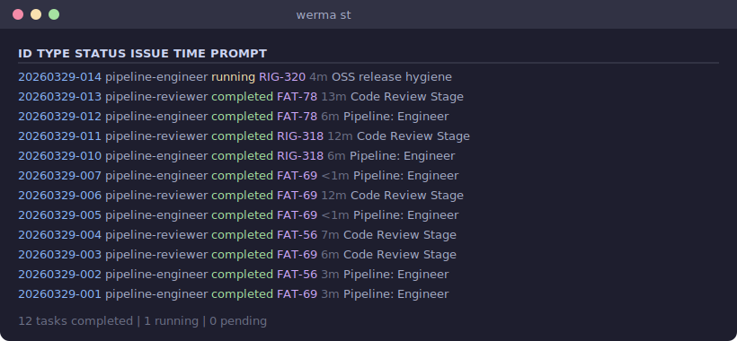

# Werma

**AI delivery engine that turns Linear issues into merged PRs through a reliable multi-stage pipeline.**

AI can write code. Werma makes sure it ships.



## What Werma Is Today

Werma is an **early-alpha CLI** built in Rust. It works — we use it daily to ship real code across multiple repositories — but the edges are rough and the API will change.

What it can do right now:

- **Full delivery pipeline** — Linear issue &rarr; analyst &rarr; engineer &rarr; reviewer &rarr; deployer &rarr; done. Each stage is an AI agent running in tmux with appropriate permissions (read-only for review, edit for code, full shell for deploy).
- **Transactional outbox** — External API calls (Linear, GitHub, Slack) go through a durable outbox with exponential retry and dead-letter queue. No more lost state transitions.
- **Single binary + SQLite** — No external services, no Docker, no Kubernetes. One Rust binary, one database file. Install and run in 30 seconds.

What you should expect at this stage: breaking changes between versions, incomplete documentation, and workflows tuned to our team's setup. We're not pretending otherwise.

## Why Open Source Now

We open-sourced Werma early because the best way to build developer tools is to build them with developers.

- **Develop in public** — AI agent orchestration is a new problem space. We'd rather iterate in the open, get feedback on real usage, and course-correct early than polish in private and ship something nobody asked for.
- **Feedback over features** — We have strong opinions about how AI agents should deliver code (pipelines, verdicts, outbox reliability), but we want to stress-test those opinions against teams that aren't us.
- **Honest engineering** — If something is broken, you can see it. If something is missing, you can ask for it. No marketing layer between the code and the people using it.

## Where Werma Is Going

Werma's north star: **make a single developer as effective as a small team** by handling the delivery pipeline end-to-end.

What that looks like over time:

- **Tracker-agnostic** — Linear today, but the pipeline engine doesn't need to be coupled to any single tracker. GitHub Issues, Jira, and others are on the roadmap.
- **Wave execution** — Launch a batch of issues as a wave, track them as a unit, and get notified when the wave completes. Parallel delivery across an entire sprint.
- **Agent evaluation** — Built-in rubrics and golden datasets to measure agent quality, not just whether the task completed.
- **Self-improving prompts** — Memory and feedback loops so pipeline agents get better at your codebase over time.

None of this is in the codebase yet. It's the direction, not a promise. If any of it excites you, [open an issue](https://github.com/RigpaLabs/werma/issues) or [start a discussion](https://github.com/RigpaLabs/werma/discussions).

## Install

### GitHub Releases (recommended)

Download the latest binary from [Releases](https://github.com/RigpaLabs/werma/releases).

### Build from source

```bash
cargo install --git https://github.com/RigpaLabs/werma werma
```

Or clone and build:

```bash
git clone https://github.com/RigpaLabs/werma
cd werma/engine
cargo build --release
# Binary at target/release/werma
```

### Requirements

- Rust 1.88+ (build from source)
- [Claude Code](https://docs.anthropic.com/en/docs/claude-code) CLI (agent runtime)
- tmux (agent sessions)
- macOS or Linux

## Quick Start

```bash
# Add a task to the queue
werma add "Research best practices for error handling in async Rust" -t research

# Run the next pending task (launches a Claude Code agent in tmux)
werma run

# Run all pending tasks in parallel
werma run-all

# Check status of all tasks
werma st

# Review a pull request with an AI reviewer agent
werma review 42
```

### Pipeline Mode (Linear Integration)

```bash
# Install the daemon (polls Linear, processes completions, drains outbox)
werma daemon install

# Check pipeline status — which issues are at which stage
werma pipeline status

# Manually trigger a pipeline stage for an issue
werma pipeline run RIG-42 --stage analyst
```

## Architecture

```
                    ┌─────────────┐
                    │   Linear    │  Issue tracker
                    └──────┬──────┘
                           │ poll (30s)
                    ┌──────▼──────┐
                    │   Daemon    │  Tick loop: poll, callbacks, effects
                    └──────┬──────┘
                           │
              ┌────────────┼────────────┐
              │            │            │
        ┌─────▼─────┐ ┌───▼───┐ ┌─────▼─────┐
        │  Pipeline  │ │ Queue │ │  Effects  │
        │  Callback  │ │       │ │  Outbox   │
        └─────┬──────┘ └───┬───┘ └─────┬─────┘
              │            │            │
              │      ┌─────▼─────┐     │
              └─────►│  Runner   │◄────┘
                     └─────┬─────┘
                           │ spawn
                     ┌─────▼─────┐
                     │   tmux    │  Isolated agent sessions
                     │ sessions  │  (one per task)
                     └───────────┘
```

### Pipeline Stages

Issues flow through a YAML-configured pipeline. Each stage runs a specialized agent:

| Stage | Agent Type | What It Does |
|-------|-----------|--------------|
| **Analyst** | read-only | Writes technical spec, sets labels |
| **Engineer** | edit | Creates branch, writes code, opens PR |
| **Reviewer** | read-only | Reviews PR on GitHub, approves or requests changes |
| **Deployer** | full (shell) | Merges PR, triggers deploy, runs health checks |

Each agent emits a **verdict** on its last output line (e.g., `VERDICT=DONE`, `REVIEW_VERDICT=APPROVED`). The pipeline engine parses verdicts and transitions issues to the next stage automatically.

### Agent Roles

| Agent | Role | Personality |
|-------|------|-------------|
| **Watchdog** | Infrastructure guardian | Silent sentinel, alerts only on problems |
| **Analyst** | Technical research & specs | Methodical researcher, thorough documenter |
| **Engineer** | Implementation | Pragmatic builder, clean code advocate |
| **Reviewer** | Code review | Sharp-eyed critic, fair but demanding |
| **QA** | Quality assurance | Meticulous tester, no shortcuts |
| **DevOps** | Deploy & monitoring | Calm operator, safety-first |

### Task Types

| Type | Permissions | Use For |
|------|------------|---------|
| `research` | Read-only | Research, documentation, analysis |
| `analyze` | Read-only | Code review, audits, specs |
| `code` | Edit files | Writing/modifying code |
| `full` | Edit + shell | Deploy, infra, anything needing bash |

## Configuration

Werma stores runtime data in `~/.werma/`:

```
~/.werma/
├── werma.db        # SQLite database (tasks, effects, schedules)
├── config.toml     # User configuration (optional)
├── .env            # Credentials (LINEAR_API_KEY, etc.)
├── logs/           # Per-task agent logs + daemon.log
└── backups/        # Automatic DB backups
```

### Environment Variables

Copy `.env.example` to `~/.werma/.env` and fill in your keys:

| Variable | Required | Description |
|----------|----------|-------------|
| `LINEAR_API_KEY` | For pipeline | Linear API key for issue tracking |
| `SLACK_BOT_TOKEN` | No | Slack bot token for notifications |
| `GITHUB_TOKEN` | No | GitHub token for self-update / private repos |

### Pipeline Configuration

The pipeline config is compiled into the binary (`engine/pipelines/default.yaml`). To inspect it:

```bash
# View the current pipeline stages and transitions
werma pipeline show

# Validate the config
werma pipeline validate
```

To customize stages, edit `engine/pipelines/default.yaml` and rebuild.

## Effects Outbox

External side effects (Linear state changes, GitHub PR creation, Slack notifications) are processed through a durable outbox:

```bash
# List pending and failed effects
werma effects

# Show dead-lettered effects (exhausted retries)
werma effects dead

# Retry a failed effect
werma effects retry <id>
```

Effects use exponential backoff (5s &rarr; 30s &rarr; 120s &rarr; 300s &rarr; 600s) and are classified as **blocking** (must succeed for pipeline to continue) or **best-effort** (retried independently).

## Scheduling

Run tasks on a cron schedule via the daemon:

```bash
# Add a daily research task
werma sched add daily-review "0 9 * * 1-5" "Review open PRs and summarize status" --type research

# List schedules
werma sched ls

# Enable/disable without deleting
werma sched on daily-review
werma sched off daily-review
```

## Contributing

See [CONTRIBUTING.md](CONTRIBUTING.md) for development setup, conventions, and workflow.

```bash
make check   # fmt, clippy, test — all in one
```

## Philosophy

Werma (&#x0F5D;&#x0F7A;&#x0F62;&#x0F58;) means "warrior spirit" in the Bon tradition. They protect, execute, and maintain order. This tool embodies the same principle: reliable execution of well-defined tasks, with clear boundaries and accountability at each stage.

## License

[MIT](LICENSE)
